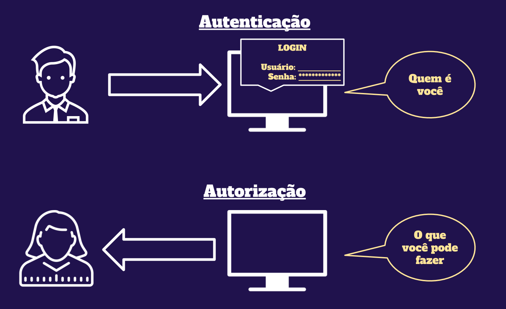

##### 2024-IA22-2TRI
# *iniciando o tutorial* 👍

<div style="display: inline_block"><br/>
   
</div>


###### (em alguns momentos vou parecer repetitivo e falar coisas óbvias, basicamente pq esse tutorial foi feito pra qualquer tongão fazer.) `AVISO` o codespace as vezes é meio lento, então não se assuste se as coisas não funcionarem imediatamente

<div style="display: inline_block"><br/>
   
</div>

# primeiramente, preciso te explicar o que nós vamos fazer e como funciona. sugiro que você preste atenção simplesmente pq vale nota para nós dois.

## o que é Autenticação de Usuários (*Single Server*)?
### bom, basicamente é um processo de verificação da identidade de um usuário que está tentando acessar um sistema. No modelo Single Server, um único servidor gerencia todo o processo de autenticação, mantendo informações sobre usuários, como senhas e dados de sessão.

### `1.` O usuário envia suas credenciais (geralmente um nome de usuário e senha) para o servidor.

### `2.` O servidor verifica se essas credenciais estão corretas comparando com o que está armazenado em seu banco de dados.

### `3.` Se as credenciais forem válidas, o usuário é autenticado e pode acessar os recursos protegidos.

<div style="display: inline_block"><br/>
   
</div>

## e quanto a `Autenticação` vs. `Autorização`?
### Mesmo os termos sejam usados frequentemente juntos, eles têm significados diferentes:

### `*` Autenticação: É o processo de verificar quem é o usuário. Exemplo: quando você faz login com seu nome de usuário e senha, você está se autenticando.

### `*` Autorização: É o processo de determinar se um usuário autenticado tem permissão para acessar um recurso específico. Exemplo: depois de autenticado, o sistema verifica se você tem permissão para acessar determinada página ou funcionalidade.

<div style="display: inline_block"><br/>
   
</div>

<div style="display: inline_block"><br/>
   
</div>

### a primeira coisa que devemos fazer antes de começar é criar um codespace. não sabe fazer isso? veja o tutorial abaixo:
<a href="https://github.com/prof-varela/tutoriais/blob/main/tutorial/codespace.md" style="background-color: #4CAF50; color: white; padding: 10px 20px; text-align: center; text-decoration: none; display: inline-block; border-radius: 4px;">Tutorial Codespace</a>


# `1.`iniciando o nosso projeto:
### abra o terminal (ctrl + ' ) e execute os comandos abaixo. talvez apareça uma mensagem de erro/atenção mas não se preocupe, pode executar tudo de uma vez! 

```
npm init -y && \
npm install express cors sqlite3 sqlite && \
npm install --save-dev typescript nodemon ts-node @types/express @types/cors && \
npx tsc --init && \
mkdir -p src public src/services src/key-mappers && \
touch src/app.ts src/database.ts public/index.html public/index2.css public/index.css public/listagem.html public/main.js initial-users.json src/services/user.services.ts src/key-mappers/addAliasDots.ts src/key-mappers/index.ts

```

<div style="display: inline_block"><br/>
   
</div>

# `2.`
# 